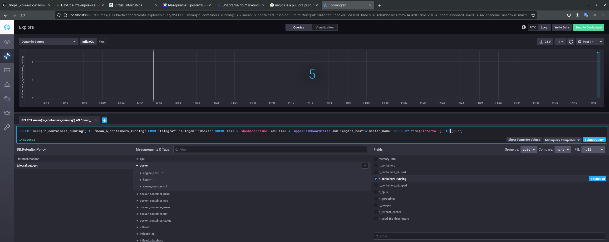

# 10-monitoring-02-systems

## Ответы на вопросы

### 1. **Вас пригласили настроить мониторинг на проект. На онбординге вам рассказали, что проект представляет из себя платформу для вычислений с выдачей текстовых отчетов, которые сохраняются на диск. Взаимодействие с платформой осуществляется по протоколу http. Также вам отметили, что вычисления загружают ЦПУ. Какой минимальный набор метрик вы выведите в мониторинг и почему?**

**Ответ:**

Основные ("Золотые сигналы"):

    - Время отклика системы (особенно с увеличением нагрузки)
    - Величина трафика (http-запросов) + количество ответов сервера с ошибками (5хх,4xx). Может показать как сервис спраляется с нагрузкой при увеличении запросов.
    - Загрузка CPU (load average 1,5,15 min), FS. Может показать на сколько сервис загружает систему при увеличении количества запросов, сложности вычислений. Можно вывести отношение количества обращений к FS с количеством запросов к  (линейно ли меняется количесвто I/O опреаций FS в зависимости от нагрузки системы).

Так же для лучшего представления о работе сервиса можно добавить следующие метрики:

    - Время использования CPU (%) основным процессом сервиса и других процессов системы. Для получения информации на сколько доп. вспомогательные процессы влияют на загрузку системы, особенно при увеличении загрузки на сервис (увеличение кол-ва завпросов, увеличение сложности расчетов).
    - Загрузка RAM основным и доп. процессами системы.
    - Если сервис многопоточный, то количество дочерних процессов от основгого при нагрузке системы
    - Количесвто и время простоя дочерних процессов сервиса

### 2. **Менеджер продукта посмотрев на ваши метрики сказал, что ему непонятно что такое RAM/inodes/CPUla. Также он сказал, что хочет понимать, насколько мы выполняем свои обязанности перед клиентами и какое качество обслуживания. Что вы можете ему предложить?**

**Ответ:**

RAM - загрузка оперативной памяти
inodes - количество файловых дескрипторов (открытых файлов)
CPUla - загрузка системы (соотношение количества работающих процессов (обрабатываемых CPU) к количеству процессов в ожидании обработки (в очереди) в разрезе интервалов времени, обычно 1,5,10 мин.)

В рамках SLA в качестве SLO можно предложить:

    - Время доступности сервиса должно быть 24/7 (99% времени), с интервалом не более 15 мин (1% от времени доступности) в сутки на временные тех. работы, форс. мажоры;
    - Время отклика сервиса - не более 3 сек.;
    - Количество ошибок в ответах - не более 1% на 10 запросов.

Для соблюдения SLO необходимо, что бы SLI были следующими:

    - Загрузка RAM системы - не более 70%;
    - CPU LA не должны превышать значения 1.1;
    - Количество inodes не должно превышать критического порога - макс. количства inodes, при котором при котором нагрузка на FS и RAM не влияет на заявленные SLO работы сервиса; очень зависит от количества процессов сервиса в простое (CPU LA).

### 3. **Вашей DevOps команде в этом году не выделили финансирование на построение системы сбора логов. Разработчики в свою очередь хотят видеть все ошибки, которые выдают их приложения. Какое решение вы можете предпринять в этой ситуации, чтобы разработчики получали ошибки приложения?**

**Ответ:**

Можно развернуть следующие варианты ПО мониторинга:

    1) Стек ELK. Саммое распространенное решение для мониторинга логов. OpenSource
    2) Setnry. Отслеживание и агрегирование ошибок работы программы в реальном времени с нотификацией о событиях. Есть бесплатная, без ограничений self-hosted OpenSource версия стека (Sentry app.PostgreSQL, Redis, memcached, Kafka + Zookeeper), либо облачная с ограничениями;
    3) Стек: Vector + noSQL DB (Clickhouse, prometheus) + GUI (Lighthouse);
    4) собственный скрипт выборки сообщений об ошибках из логов и отправки на почту комады разработчиков.

### 4. **Вы, как опытный SRE, сделали мониторинг, куда вывели отображения выполнения SLA=99% по http кодам ответов. Вычисляете этот параметр по следующей формуле: summ_2xx_requests/summ_all_requests. Данный параметр не поднимается выше 70%, но при этом в вашей системе нет кодов ответа 5xx и 4xx. Где у вас ошибка?**

**Ответ:**

Ответы http-сервера, отличные от 2хх могут быть не только с кодом 4хх, 5хх, В формуле метрики не учтены другие коды ответов (1хх, 3хх).

### 5. **Опишите основные плюсы и минусы pull и push систем мониторинга.**

**Ответ:**

Для pull характерны следующие приимущества:

    - Запросы по необходимости (тогда, когда нужно серверу). В свою очередь может положительно влиять на нагрузку сети;
    - Явное выявление отсутсвия опрашиваемого хоста, неполадок в сет. соединении до хоста;
    - Легче контролировать подлинность данных;
    - Можно настроить единый proxy server до всех агентов с TLS;
    - Упрощённая отладка получения данных с агентов.

Для push характерны следующие приимущества:

    - Независимость получения метрик от агентов-хостов. Нет необходимости в опрашивании хостов сервером. Можно настроить агенты для отправки данных только при определенных случаях;
    - Возможность отправлять метрики на несколько серверов без потери производительности сети. Упрощение репликации данных в разные системы мониторинга или их резервные копии;
    - олее гибкая настройка отправки пакетов данных с метриками;
    - основно протокол отправки пакетов с метриками - UDP, менее затратный способ передачи данных, из-за чего может возрасти производительность сбора метрик.

### **6. Какие из ниже перечисленных систем относятся к push модели, а какие к pull? А может есть гибридные?**

**Ответ:**

Prometheus - pull модель. Данные передаются от агентов по pull-запросам, например nodeexporter. Так же сервер может отправлять push-алерты; 
TICK - push модель. Данные передают на сервер InfluxDB агенты Telegraf;
Zabbix - push&pull. Данные передаются на сервер агентами, клиентами, либо сервер опрашивает клиентов сам, например посредством snmp;
VictoriaMetrics - push&pull. pull-модель может осуществляться, например, сборами метрик по запросам от prometheus exporters, таких как nodeexporter; 
Nagios - push модель. Данные передают на сервер Nagios Core через различные plugin'ы.

### **7. Решение по заданию запуска TICK-стека:**

### **8. Отображением метрик утилизации cpu из веб-интерфейса:**

### **9. Метрики docker:**

